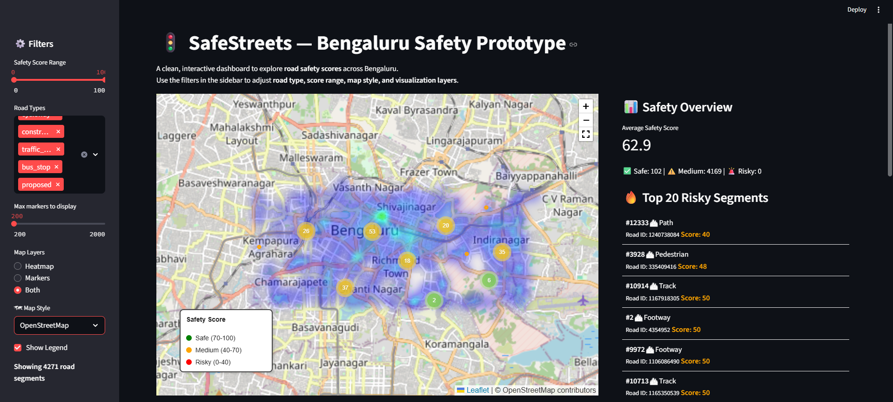

# 🚦 SafeStreets — Real-time Road Safety Intelligence (Prototype)

Google Maps shows you traffic. **SafeStreets** shows you *safety*.  
This project analyzes road networks in Bengaluru using **OpenStreetMap data** and computes a contextual **safety score per segment** — visualized on an interactive dashboard.  

---

## 🌟 Current Capabilities
✅ Road-level safety scoring using OSM features (speed, lighting, sidewalks, road complexity)  
✅ Interactive Streamlit dashboard with **heatmap & clustered markers**  
✅ Dynamic filters for score ranges & road types  
✅ Exportable datasets (CSV) for further analysis  
✅ Configurable scoring pipeline (YAML-based) for easy extension  

---

## 📊 Tech Stack
- **Backend/Data** → Python, Pandas, OSMnx  
- **Frontend** → Streamlit, Folium  
- **Visualization** → Heatmaps, smart marker clustering  
- **Planned** → ML-based safety prediction, crowdsourced signals, safer routing engine  

---

## 🚀 Roadmap
- Integrate accident & crime datasets for richer scoring  
- Train ML models to predict safety dynamically  
- Add safer-route recommendations for urban navigation  
- Expand coverage to multiple Indian cities  

---

## ⚖️ License
MIT  
Open to collaborations and contributions.  

---