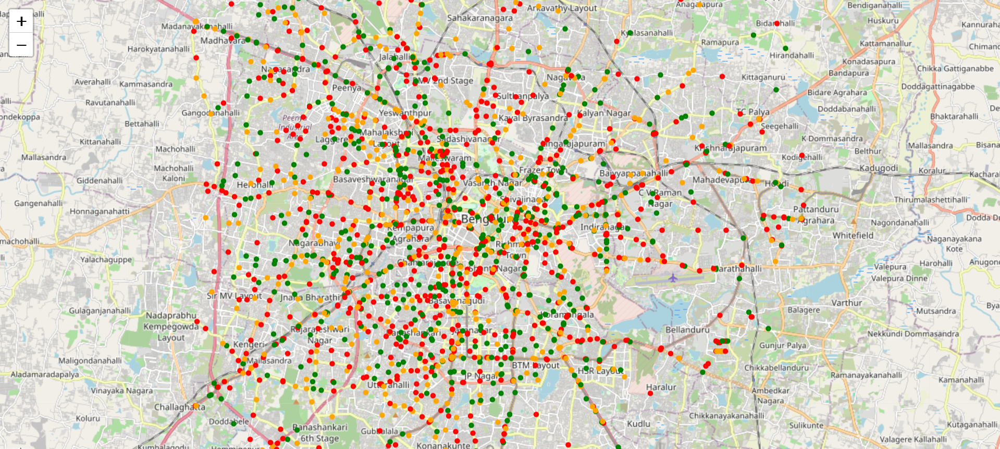

# SafeStreets 🚦 — AI-Powered Urban Safety Scores for Indian Cities

---

## 📝 Problem
Urban safety in India is underserved in tech. Citizens often lack **real-time, contextual awareness of unsafe areas**.  
SafeStreets aims to provide **safety scores for neighborhoods and routes**, helping users make informed decisions.  

---

## 🎯 MVP (v0)
- City-level + geo-tagged incident data
- Safety score: ✅ Safe / ⚠️ Warning / ❌ Unsafe
- Heatmap visualization of safety zones
- Recommended safer alternate routes/areas
- Stack: Python, Pandas, scikit-learn, Streamlit, Folium/Mapbox

---

## 🚦 Prototype — Safety Score Mockup

Here’s an early prototype of how SafeStreets assigns a **Safety Score** to road intersections.  
(Currently using synthetic data to illustrate the concept.)

- 🟢 Green = safer zones  
- 🟠 Orange = medium risk  
- 🔴 Red = high risk  

👉 **Next phase:** Replace synthetic data with real-world signals like crime reports, accident logs, street-light coverage, and crowdsourced inputs.

---

## 🛠️ Tech Stack
- **Python 3.10+**
- Pandas, NumPy, scikit-learn
- Folium / Mapbox for interactive maps
- Streamlit (planned for dashboard)
- Jupyter Notebooks for EDA

---

## 🚀 Roadmap
- [x] Initialize repo + folder structure
- [x] OSM data pull + visualization
- [x] Mock safety score heatmap
- [ ] Integrate real crime/accident datasets
- [ ] Feature engineering for safety signals
- [ ] Streamlit dashboard (MVP UI)
- [ ] API endpoint for safety score lookup

---

## 📌 Current Status
Repo initialized ✅ | Researching data sources 🔍 | Next: data ingestion + EDA 📊  

---

## 📜 License
This project is licensed under the MIT License.
